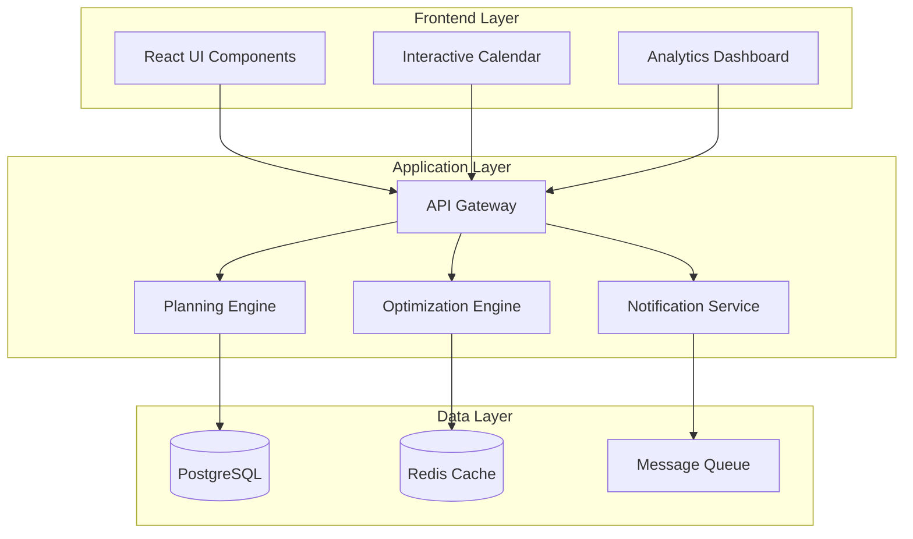
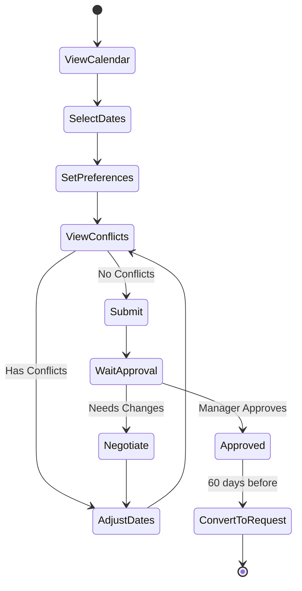
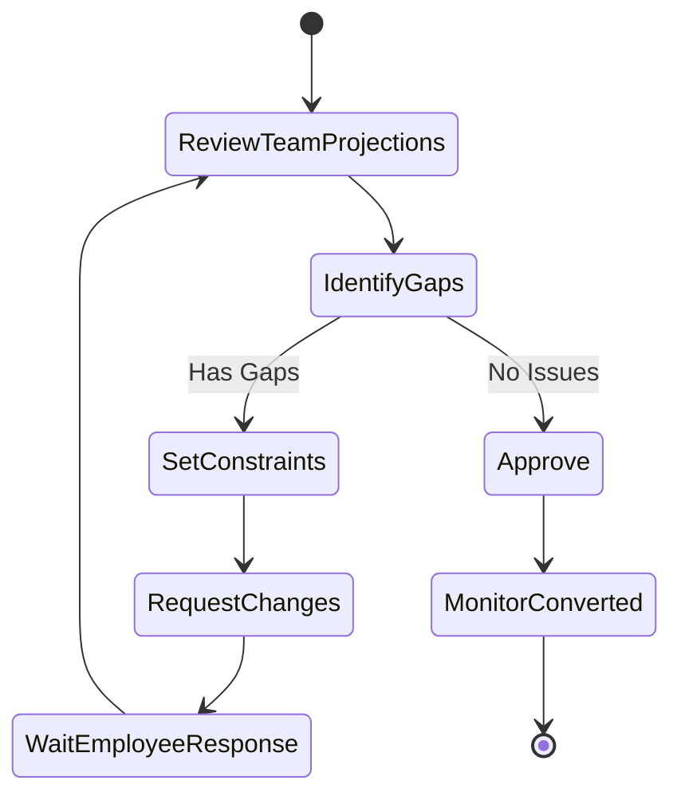

# Annual Leave Planning System - Technical Implementation Guide

## System Architecture Overview



---

## Data Models

### Core Entities

```sql
-- Main planning projection entity
CREATE TABLE yearly_projections (
    id UUID PRIMARY KEY,
    employee_id UUID REFERENCES users(id),
    year INTEGER NOT NULL,
    status ENUM('draft', 'submitted', 'approved', 'waitlisted', 'rejected'),
    created_at TIMESTAMP,
    submitted_at TIMESTAMP,
    approved_at TIMESTAMP,
    approved_by UUID REFERENCES users(id),
    planning_window_id UUID REFERENCES planning_windows(id),
    priority_score INTEGER, -- For fairness algorithm
    
    INDEX idx_year_employee (year, employee_id),
    INDEX idx_status (status)
);

-- Individual projected leave days
CREATE TABLE projection_dates (
    id UUID PRIMARY KEY,
    projection_id UUID REFERENCES yearly_projections(id),
    date DATE NOT NULL,
    leave_type_id UUID REFERENCES leave_types(id),
    flexibility ENUM('fixed', 'flexible_week', 'flexible_month'),
    preference_level ENUM('preferred', 'flexible', 'considering'),
    is_converted BOOLEAN DEFAULT FALSE,
    converted_request_id UUID REFERENCES leave_requests(id),
    
    UNIQUE KEY unique_employee_date (projection_id, date),
    INDEX idx_date (date),
    INDEX idx_converted (is_converted)
);

-- Planning window configuration
CREATE TABLE planning_windows (
    id UUID PRIMARY KEY,
    year INTEGER NOT NULL,
    opens_at TIMESTAMP,
    closes_at TIMESTAMP,
    status ENUM('scheduled', 'open', 'optimizing', 'finalizing', 'closed'),
    settings JSONB, -- Stores rules, constraints, etc.
    
    UNIQUE KEY unique_year (year)
);

-- Coverage requirements by team/department
CREATE TABLE coverage_requirements (
    id UUID PRIMARY KEY,
    department_id UUID REFERENCES departments(id),
    date DATE,
    minimum_staff INTEGER,
    minimum_senior_staff INTEGER,
    required_skills JSONB,
    is_protected BOOLEAN DEFAULT FALSE,
    protection_reason TEXT,
    
    INDEX idx_dept_date (department_id, date)
);

-- Projection conflicts and negotiations
CREATE TABLE projection_conflicts (
    id UUID PRIMARY KEY,
    date DATE,
    department_id UUID,
    severity ENUM('low', 'medium', 'high', 'critical'),
    affected_projections JSONB, -- Array of projection IDs
    resolution_status ENUM('unresolved', 'negotiating', 'resolved'),
    resolution_details JSONB,
    
    INDEX idx_status (resolution_status)
);

-- Trading/negotiation requests
CREATE TABLE projection_trades (
    id UUID PRIMARY KEY,
    requester_id UUID REFERENCES users(id),
    target_id UUID REFERENCES users(id),
    requester_dates JSONB,
    target_dates JSONB,
    status ENUM('proposed', 'accepted', 'rejected', 'expired'),
    message TEXT,
    created_at TIMESTAMP,
    responded_at TIMESTAMP
);

-- Analytics and historical data
CREATE TABLE projection_analytics (
    id UUID PRIMARY KEY,
    year INTEGER,
    employee_id UUID,
    department_id UUID,
    popular_periods_count INTEGER, -- Times selected popular dates
    flexibility_score DECIMAL(3,2), -- How flexible they were
    trade_participation INTEGER, -- Number of trades
    historical_fairness_score DECIMAL(3,2)
);
```

---

## Implementation Options

### Option A: Soft Planning with Gradual Commitment

#### How it Works
1. **Open Planning Phase**: Employees add "wishes" without constraints
2. **Visibility Phase**: Everyone sees overlaps, system suggests alternatives
3. **Negotiation Phase**: Automated and manual conflict resolution
4. **Commitment Phase**: Soft projections become firm intentions
5. **Conversion Phase**: Throughout year, convert to actual requests

#### Technical Flow

```typescript
// State machine for projection lifecycle
enum ProjectionState {
  WISH = 'wish',           // Initial selection
  NEGOTIATING = 'negotiating', // In conflict resolution
  SOFT_COMMIT = 'soft_commit', // Agreed but changeable
  FIRM_COMMIT = 'firm_commit', // Locked in
  CONVERTED = 'converted'      // Became actual request
}

// Projection state transitions
const transitions = {
  [ProjectionState.WISH]: ['negotiating', 'soft_commit'],
  [ProjectionState.NEGOTIATING]: ['wish', 'soft_commit'],
  [ProjectionState.SOFT_COMMIT]: ['firm_commit', 'wish'],
  [ProjectionState.FIRM_COMMIT]: ['converted'],
  [ProjectionState.CONVERTED]: [] // Terminal state
}
```

#### API Endpoints

```yaml
Planning Window Management:
  POST   /api/planning/windows/create
  GET    /api/planning/windows/{year}/status
  POST   /api/planning/windows/{year}/advance-phase

Employee Projections:
  GET    /api/planning/projections/my/{year}
  POST   /api/planning/projections/dates/add
  DELETE /api/planning/projections/dates/{id}
  PATCH  /api/planning/projections/dates/{id}/flexibility
  POST   /api/planning/projections/submit

Coverage Analysis:
  GET    /api/planning/coverage/{date}
  GET    /api/planning/coverage/gaps/{department}
  GET    /api/planning/coverage/heatmap/{year}

Conflict Resolution:
  GET    /api/planning/conflicts/my
  POST   /api/planning/trades/propose
  POST   /api/planning/trades/{id}/respond
  GET    /api/planning/suggestions/alternatives
```

---

### Option B: Allocation-Based with Credits System

#### How it Works
1. **Credit Distribution**: Each employee gets planning credits
2. **Bidding Phase**: Use credits to bid on preferred dates
3. **Allocation Algorithm**: System allocates based on bids + fairness
4. **Adjustment Period**: Trade and negotiate allocations
5. **Finalization**: Lock in final distribution

#### Credit System Algorithm

```typescript
interface EmployeeCredits {
  baseCredits: 100,           // Everyone starts with 100
  seniorityBonus: number,      // +5 per year of service (max 50)
  previousYearPenalty: number, // -20 if got Christmas last year
  flexibilityBonus: number,    // +10 for being flexible previous year
  total: number
}

interface DateBidding {
  date: Date,
  creditsUsed: number,
  priority: 'high' | 'medium' | 'low',
  alternativeDates: Date[]
}

// Allocation algorithm
function allocateDates(bids: DateBidding[], constraints: CoverageRequirements) {
  // Sort by credits bid (highest first)
  const sorted = bids.sort((a, b) => b.creditsUsed - a.creditsUsed);
  
  // Apply fairness modifiers
  const withFairness = applyFairnessScores(sorted);
  
  // Check coverage constraints
  const validated = validateCoverage(withFairness, constraints);
  
  // Return allocations with waitlist
  return {
    approved: validated.approved,
    waitlisted: validated.waitlisted,
    rejected: validated.rejected
  };
}
```

---

### Option C: AI-Optimized Distribution (Recommended)

#### How it Works
1. **Preference Collection**: Employees rank date preferences (1-10)
2. **Constraint Definition**: Managers set hard/soft constraints
3. **AI Optimization**: Algorithm finds optimal distribution
4. **Review Period**: Humans review and request adjustments
5. **Final Approval**: Lock in optimized plan

#### Optimization Engine

```python
# Optimization problem definition
class LeaveOptimizer:
    def __init__(self):
        self.solver = ConstraintSolver()
    
    def optimize(self, preferences, constraints):
        # Objective function: Maximize total satisfaction
        objective = sum(
            preference.rank * assignment 
            for preference, assignment in zip(preferences, assignments)
        )
        
        # Constraints
        constraints = [
            # Coverage constraints
            MinimumCoverage(department, date, min_staff),
            
            # Fairness constraints
            MaxConsecutiveDays(employee, 14),
            FairDistribution(popular_periods),
            
            # Business constraints
            ProtectedPeriods(critical_dates),
            SkillCoverage(required_skills)
        ]
        
        # Solve
        solution = self.solver.maximize(objective, constraints)
        return solution

# Scoring algorithm
def calculate_satisfaction_score(employee_preferences, allocated_dates):
    score = 0
    for date in allocated_dates:
        if date in employee_preferences.preferred:
            score += 10
        elif date in employee_preferences.flexible:
            score += 7
        elif date in employee_preferences.considering:
            score += 4
    return score / max_possible_score
```

#### Machine Learning Component

```python
# Predict optimal distribution based on historical patterns
class PlanningPredictor:
    def __init__(self):
        self.model = load_model('planning_optimizer.pkl')
    
    def predict_conflicts(self, proposed_dates):
        features = extract_features(proposed_dates)
        conflict_probability = self.model.predict(features)
        return conflict_probability
    
    def suggest_alternatives(self, employee, requested_dates):
        # Based on historical acceptance rates
        alternatives = self.model.suggest_alternatives(
            employee_profile=employee,
            requested=requested_dates,
            team_coverage=get_team_coverage()
        )
        return alternatives.top_5()
```

---

## User Flows

### Employee Flow



### Manager Flow



---

## Frontend Components

### Interactive Calendar Component

```typescript
interface CalendarProps {
  mode: 'planning' | 'viewing' | 'converting';
  year: number;
  employeeId: string;
  teamView: boolean;
}

const PlanningCalendar: React.FC<CalendarProps> = () => {
  // State management
  const [selectedDates, setSelectedDates] = useState<Date[]>([]);
  const [viewMode, setViewMode] = useState<'month' | 'year'>('year');
  const [overlayData, setOverlayData] = useState<CoverageData>();
  
  // Features
  const features = {
    dragSelect: true,           // Drag to select multiple dates
    conflictHighlighting: true, // Show conflicts in real-time
    teamOverlay: true,         // See teammate selections
    coverageHeatmap: true,     // Show coverage levels
    smartSuggestions: true     // AI-powered alternatives
  };
  
  return (
    <CalendarGrid
      renderDay={(date) => (
        <DayCell
          date={date}
          coverage={getCoverage(date)}
          conflicts={getConflicts(date)}
          teammates={getTeammates(date)}
          isSelected={selectedDates.includes(date)}
          isProtected={protectedDates.includes(date)}
        />
      )}
    />
  );
};
```

### Coverage Dashboard

```typescript
const CoverageDashboard: React.FC = () => {
  return (
    <Dashboard>
      <HeatmapView>
        {/* Department x Month grid showing coverage levels */}
      </HeatmapView>
      
      <TimelineView>
        {/* Gantt chart of all team projections */}
      </TimelineView>
      
      <GapAnalysis>
        {/* List of critical coverage gaps */}
      </GapAnalysis>
      
      <FairnessMetrics>
        {/* Distribution equity scores */}
      </FairnessMetrics>
    </Dashboard>
  );
};
```

---

## Backend Services

### Planning Engine Service

```typescript
class PlanningEngine {
  async createProjection(employeeId: string, dates: ProjectionDate[]) {
    // Validate employee eligibility
    await this.validateEmployee(employeeId);
    
    // Check date constraints
    const conflicts = await this.checkConflicts(dates);
    
    // Calculate priority score
    const priority = await this.calculatePriority(employeeId);
    
    // Save projection
    const projection = await this.saveProjection({
      employeeId,
      dates,
      priority,
      conflicts
    });
    
    // Trigger notifications
    await this.notifyStakeholders(projection);
    
    return projection;
  }
  
  async optimizeDistribution(departmentId: string) {
    const projections = await this.getProjections(departmentId);
    const constraints = await this.getConstraints(departmentId);
    
    // Run optimization algorithm
    const optimized = await this.optimizer.optimize(
      projections,
      constraints
    );
    
    // Generate change suggestions
    const suggestions = this.generateSuggestions(optimized);
    
    return { optimized, suggestions };
  }
}
```

### Notification Service

```typescript
class NotificationService {
  triggers = {
    WINDOW_OPEN: 'planning.window.open',
    CONFLICT_DETECTED: 'planning.conflict.detected',
    TRADE_PROPOSED: 'planning.trade.proposed',
    APPROVAL_NEEDED: 'planning.approval.needed',
    CONVERSION_REMINDER: 'planning.conversion.due'
  };
  
  async sendNotification(event: string, data: any) {
    const template = this.getTemplate(event);
    const recipients = await this.getRecipients(event, data);
    
    await this.queue.push({
      type: event,
      recipients,
      template,
      data,
      priority: this.getPriority(event)
    });
  }
}
```

---

## Integration Points

### With Existing Leave Management

```typescript
// Conversion service
class ProjectionConverter {
  async convertToRequest(projectionId: string) {
    const projection = await this.getProjection(projectionId);
    
    // Validate still valid
    if (!this.isConvertible(projection)) {
      throw new Error('Projection no longer convertible');
    }
    
    // Create leave request
    const request = await this.createLeaveRequest({
      employeeId: projection.employeeId,
      dates: projection.dates,
      type: projection.leaveType,
      isFromProjection: true,
      projectionId: projection.id
    });
    
    // Update projection status
    await this.markConverted(projectionId, request.id);
    
    return request;
  }
}
```

### With Calendar Systems

```typescript
// Calendar sync
class CalendarIntegration {
  async syncToOutlook(projection: Projection) {
    const events = projection.dates.map(date => ({
      subject: `Planned Leave - ${projection.status}`,
      start: date,
      end: date,
      isAllDay: true,
      showAs: projection.status === 'approved' ? 'oof' : 'tentative'
    }));
    
    await this.outlookAPI.createEvents(events);
  }
}
```

---

## Performance Considerations

### Caching Strategy

```typescript
// Redis cache layers
const cacheStrategy = {
  // Coverage calculations - cache for 1 hour
  coverage: {
    key: 'coverage:{date}:{department}',
    ttl: 3600
  },
  
  // Conflict detection - cache for 15 minutes
  conflicts: {
    key: 'conflicts:{year}:{department}',
    ttl: 900
  },
  
  // Optimization results - cache for 1 day
  optimization: {
    key: 'optimization:{year}:{version}',
    ttl: 86400
  }
};
```

### Database Optimization

```sql
-- Materialized view for coverage analysis
CREATE MATERIALIZED VIEW mv_coverage_summary AS
SELECT 
    date,
    department_id,
    COUNT(DISTINCT employee_id) as staff_count,
    COUNT(DISTINCT CASE WHEN is_senior THEN employee_id END) as senior_count,
    array_agg(DISTINCT skill_id) as available_skills
FROM projection_dates pd
JOIN users u ON pd.employee_id = u.id
WHERE pd.status = 'approved'
GROUP BY date, department_id;

-- Refresh strategy
CREATE INDEX idx_mv_coverage ON mv_coverage_summary(date, department_id);
REFRESH MATERIALIZED VIEW CONCURRENTLY mv_coverage_summary;
```

---

## Security Considerations

```typescript
// Permission model
const permissions = {
  employee: {
    read: ['own_projections', 'team_coverage_summary'],
    write: ['own_projections'],
    delete: ['own_projections_draft']
  },
  
  manager: {
    read: ['team_projections', 'department_coverage', 'conflicts'],
    write: ['coverage_requirements', 'approval_status'],
    delete: []
  },
  
  hr: {
    read: ['all_projections', 'analytics', 'conflicts'],
    write: ['planning_windows', 'fairness_rules'],
    delete: ['invalid_projections']
  }
};

// Data privacy
const privacyRules = {
  anonymization: ['show_count_only', 'hide_names_in_conflicts'],
  audit: ['log_all_changes', 'track_approvals'],
  retention: ['keep_projections_3_years', 'archive_old_data']
};
```

---

## Deployment Strategy

### Feature Flags

```typescript
const featureFlags = {
  'planning.enabled': true,
  'planning.ai_optimization': false, // Phase 2
  'planning.trading': true,
  'planning.auto_convert': false, // Phase 3
  'planning.mobile_app': false // Phase 2
};
```

### Migration Path

```bash
# Phase 1: Basic planning
migrate run 001_create_planning_tables.sql
migrate run 002_add_projection_dates.sql

# Phase 2: Optimization
migrate run 003_add_optimization_tables.sql
migrate run 004_create_analytics_views.sql

# Phase 3: Full automation
migrate run 005_add_ml_predictions.sql
migrate run 006_create_conversion_triggers.sql
```

---

## Recommended Approach

Based on technical feasibility and user experience, we recommend **Option C: AI-Optimized Distribution** with these phases:

### Phase 1 (Month 1-2): Basic Planning
- Simple calendar interface
- Manual conflict identification
- Basic approval workflow

### Phase 2 (Month 3-4): Smart Features
- AI optimization engine
- Automated suggestions
- Trading system

### Phase 3 (Month 5-6): Full Automation
- Auto-conversion to requests
- Predictive analytics
- Mobile app

This approach provides immediate value while building toward a sophisticated, AI-driven system that maximizes both coverage and employee satisfaction.